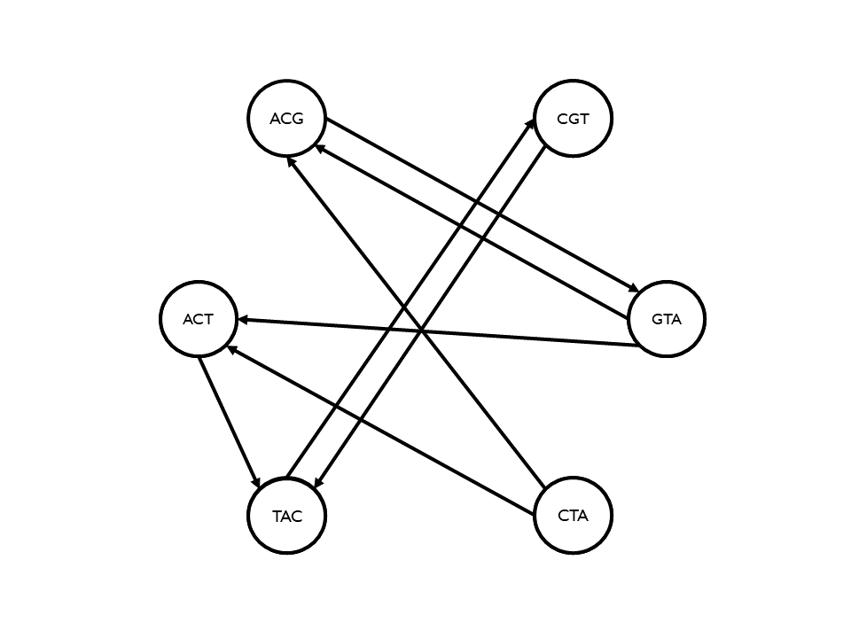

# Sekwencjonowania łańcuchów DNA z błędami negatywnymi i pozytywnymi

Autorzy: Iga Pietrusiewicz 148162 i Szymon Baliński 148225

## Opis problemu
Problem sekwencjonowania łańcuchów DNA polega na odczytaniu ciągu, który jest jednym z wielu ciągów składających się na daną sekwencję DNA, biorąc pod uwagę błędy negatywne i pozytywne. W tym celu korzysta się z oligonukleotydów o stałej długości. W ramach tej pracy zastanowiliśmy się, jak rozwiązać ten problem w przypadku, gdy mamy do czynienia z zbiorem S słów o jednakowej długości l nad alfabetem {A, B, C, D}, gdzie długość sekwencji oryginalnej to n.

## Sprowadzenie problemu selekcjonowania łańcuchów DNA do problemu znalezienia ścieżki w grafie

### Opis metody
Aby przekształcić problem selekcjonowania łańcuchów DNA na problem znalezienia ścieżki w grafie, należy stworzyć graf skierowany, w którym reprezentujemy każde słowo ze zbioru S. Następnie łączymy wierzchołki krawędziami według reguły: jeśli ostatnie $l-i$, gdzie $i \ge l$, liter wierzchołka $A$ jest identyczne z początkowymi $l-i$ literami wierzchołka $B$, to między nimi powstaje krawędź $A \rightarrow B$ o koszcie $i$. Po stworzeniu grafu, problem selekcjonowania łańcuchów DNA sprowadza się do znalezienia ścieżki o koszcie $n-l$, która odwiedza najwięcej wierzchołków.

### Przykład
Rozważamy zbiór $S = \{ACT, GTA, ACG, CTA, CGT, TAC, ACT\}$ słów o jednakowej długości $l=3$ nad alfabetem $\{A, C, G, T\}$ oraz długość sekwencji $n=8$. Poniżej przedstawiliśmy graf $G$ dla tego zbioru, w którym każdy wierzchołek odpowiada jednemu słowu w zbiorze.

Następnie tworzymy krawędzie między wierzchołkami. Tworzymy krawędzie o koszcie $i=1$, łącząc każdy wierzchołek z jego następnikiem, jeśli ostatnie 2 litery pierwszego elementu są takie same jak 2 pierwsze litery drugiego elementu. Następnie tworzymy krawędzie o koszcie $i=2$, łącząc każdy wierzchołek, jeśli ostatnia litera pierwszego elementu pokrywa się z pierwszą literą drugiego elementu. Wreszcie tworzymy krawędzie o koszcie $i=3$, łącząc wierzchołki, jeśli są one takie same. Poniżej przedstawiamy graf z wyznaczonymi krawędziami.

## Wykorzystanie algorytmu  najbliższego sąsiada do rozwiązania problemu

### Opis algorytmu
Aby rozwiązać problem, możemy zastosować algorytm najbliższego sąsiada. Ten algorytm polega na szukaniu najkrótszej drogi między dwoma wierzchołkami w grafie. W naszym przypadku mamy jednak do czynienia z dodatkowym ograniczeniem, którego algorytm nie uwzględnia - chcemy znaleźć ścieżkę o koszcie $n-l$, która odwiedza najwięcej wierzchołków. Dlatego musimy zmodyfikować algorytm.

### Zmodyfikowany algorytm najbliższego sąsiada:
1. Wylosuj wierzchołek startowy $v$.
2. Dodaj wierzchołek $v$ do listy odwiedzonych wierzchołków oraz oznacz go jako startowy.
3. Jeżeli wierzchołek $v$ ma następniki:
    1. Szukaj krawędzi o najmniejszym koszcie, łączącą wierzchołek $v$ z jego następnikiem, który oznaczamy jako $u$.
    2. Dodaj $u$ do odwiedzonych, a koszt krawędzi do sumarycznego kosztu ścieżki.
    3. Przejdź do kroku 3 z $u$ jako nowe $v$.
4. W przeciwnym razie:
    1. Jeżeli wszystkie wierzchołki były już startowymi, zakończ działanie algorytmu.
    2. Jeżeli koszt ścieżki wynosi $n-l$, a liczba wierzchołków na ścieżce jest większa niż obecne rozwiązanie, zapisz ją jako nowe rozwiązanie. 
    3. Jeżeli $v$ jest wierzchołkiem startowym, usuń wszystkie oznaczenia i przejdź do kroku 1.
    4. Oznacz obecne $v$ jako niewłaściwe i przejdź do kroku 3 z poprzednikiem obecnego $v$ jako nowe $v$.

## Analiza wyników w kontekście błędów pozytywnych i negatywnych

### Zliczanie błędów negatywnych
Aby obliczyć ilość błędów negatywnych, obliczamy różnicę pomiędzy liczbą wierzchołków rozwiązania bez błędów ($n-l+1$) a liczbą wierzchołków w znalezionej ścieżce.

### Zliczanie błędów pozytywnych
Aby oszacować ilość błędów pozytywnych, możemy policzyć liczbę wierzchołków, które nie znalazły się w odtworzonej sekwencji.

## Optymalizacja algorytmu w przypadku dodatkowej wiedzy, że instancja zawiera błędy tylko pozytywne lub negatywne

### W przypadku błędów negatywnych
Aby zoptymalizować algorytm w przypadku dodatkowej wiedzy, że instancja zawiera tylko błędy negatywne, możemy poprawić punkt $(1)$ algorytmu. W tym przypadku będziemy losować tylko wierzchołki, które nie mają poprzedników.

### W przypadku błędów pozytywnych
Aby zoptymalizować algorytm w przypadku dodatkowej wiedzy, że instancja zawiera tylko błędy pozytywne, możemy zmienić proces tworzenia grafu. W tym przypadku tworzymy wyłącznie krawędzie o koszcie $i=1$.
